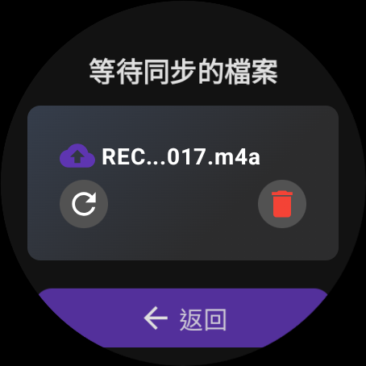

# WearNote

WearNote is a powerful voice note-taking application designed specifically for Wear OS smartwatches. It enables seamless audio recording, cloud synchronization via Google Drive, and AI-powered transcription and summarization.


## 🌟 Key Features

- **One-Touch Recording**: Start recording with a single tap or automatically when opening the app
- **Background Recording**: Continue recording even when the app is in the background or the watch screen is off
- **Cloud Synchronization**: Automatic upload to Google Drive when internet connection is available
- **AI Processing**: Convert voice recordings to text summaries (requires server integration)
- **Offline Support**: Record anytime, uploads queued automatically when offline
- **Minimal Battery Impact**: Optimized for battery efficiency on wearable devices
- **Pause/Resume**: Full control over recording sessions
- **Visual Indicators**: Clear recording status and time display
- **Pending Uploads Management**: View and manage uploads that are waiting to be processed

## 📱 App Screenshots

| Home Screen | Recording | Uploading | Pending List |
|-------------|-----------|-----------|--------------|
|  |  |  |  |

## 📋 Requirements

- Wear OS device running Wear OS 2.0+
- Google account for Drive synchronization
- Internet connection (for cloud features)
- Google Play Services

## 🚀 Getting Started

### Setup for Users

1. Install the app from Google Play Store
2. Open the app and grant required permissions
3. Sign in with your Google account when prompted
4. Start recording with a single tap

### Setup for Developers

1. Clone the repository
```bash
git clone https://github.com/yourusername/WearNote.git
```

2. Open the project in Android Studio
3. Configure Google Drive API access:
   - Create a project in [Google Cloud Console](https://console.cloud.google.com/)
   - Enable Google Drive API
   - Create OAuth credentials (Android application type)
   - Add your SHA-1 certificate fingerprint to the OAuth credentials
   - Place your `android_client_id` in `wear/src/main/res/values/strings.xml`

4. Build and run the app on a Wear OS device or emulator

## 📱 Usage Guide

### Basic Recording
- **Start**: Open app to automatically begin recording, or tap the microphone button
- **Pause/Resume**: Tap the pause/play button to control recording
- **Stop**: Tap the red stop button to finish recording and initiate upload
- **Discard**: Tap the trash button to discard the current recording

### Connectivity Features
- **Auto-Upload**: Recordings upload automatically when internet connection is available
- **Pending Uploads**: Access the pending uploads list to see items waiting for upload
- **Retry Upload**: Tap on a pending item to retry the upload manually

### Advanced Features
- **Auto-Recording**: The app starts recording automatically when opened
- **Background Recording**: Recording continues when the app is minimized
- **Auto-Exit**: After starting a recording, the app automatically returns to the watch face if no interaction is detected

## 🛠️ Technical Architecture

WearNote consists of several key components:


For more detailed technical information, see the [Technical Documentation](docs/technical/architecture.md).

## 📚 Documentation

Detailed documentation is available in the `/docs` directory:

- [User Guide](docs/user/user-guide.md): Complete guide for end users
- [Screenshots](docs/user/screenshots.md): Visual guide to the app interface
- [API Reference](docs/api/api-reference.md): Documentation of the app's APIs
- [Google Services Integration](docs/google/drive-integration.md): How the app integrates with Google services
- [Server Integration](docs/server/ai-processing.md): How to integrate with the AI processing server
- [Troubleshooting](docs/troubleshooting/solved-cases.md): Common issues and their solutions

## 📧 Contact

For support or inquiries, please open an issue on our GitHub repository or contact the maintainer at [minghunghsu.taiwan@gmail.com](mailto:minghunghsu.taiwan@gmail.com).
