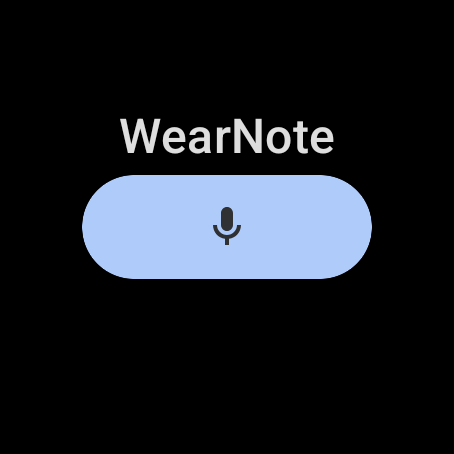
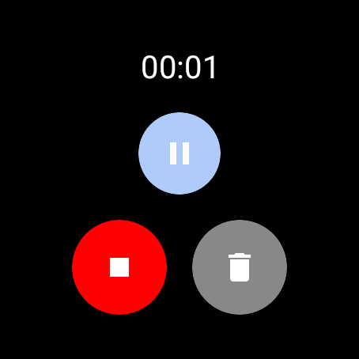

# WearNote Documentation

Welcome to the WearNote documentation. This comprehensive guide covers everything you need to know about using and developing for WearNote.

## Getting Started

- [User Guide](user/user-guide.md): Learn how to use WearNote effectively
- [Screenshots](user/screenshots.md): Visual guide to the app interface
- [Installation Guide](installation/installation.md): How to install and set up WearNote

## For Users

- [Feature Overview](user/features.md): Explore WearNote's capabilities
- [Troubleshooting](troubleshooting/solved-cases.md): Solutions to common issues

## For Developers

- [Technical Architecture](technical/architecture.md): Understanding how WearNote works
- [API Reference](api/api-reference.md): Documentation of the app's APIs
- [Google Services Integration](google/drive-integration.md): How the app integrates with Google services
- [Server Integration](server/ai-processing.md): How to integrate with the AI processing server

## Screenshots

| Home | Recording | Pending Uploads |
|------|-----------|-----------------|
||||

## Architecture Overview

The diagram below illustrates the main components of WearNote and how they interact:

## Additional Resources

- [GitHub Repository](https://github.com/yourusername/WearNote)
- [Contributing Guidelines](../CONTRIBUTING.md)
- [License](../LICENSE)
