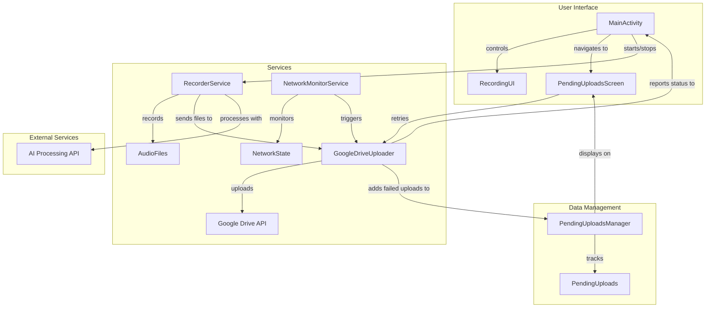
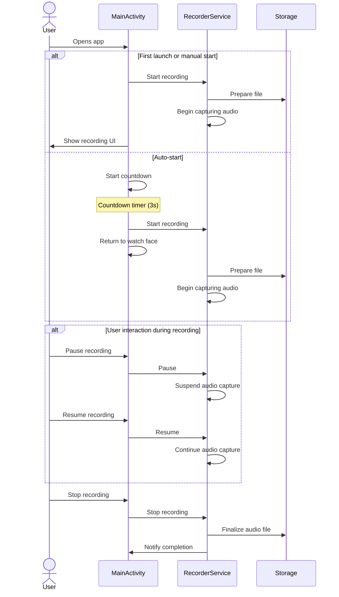
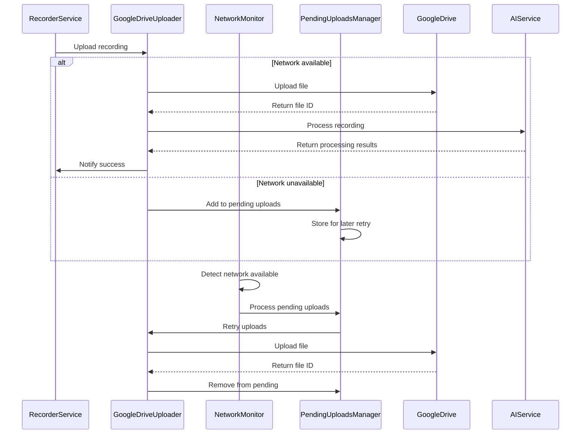
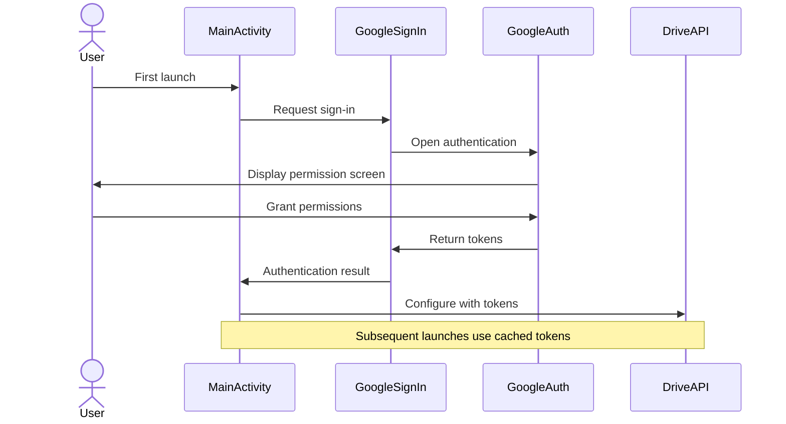
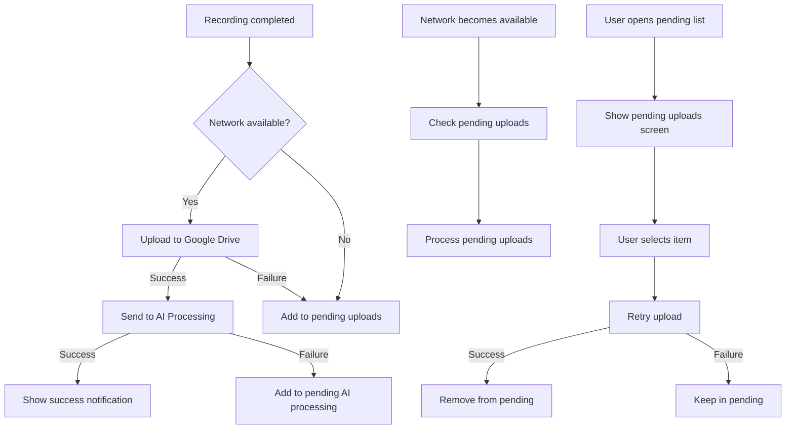

# WearNote Technical Architecture

This document outlines the technical architecture of WearNote, describing the main components and how they interact.

## Overview

WearNote is built using a service-oriented architecture with several key components working together to provide a seamless recording and cloud synchronization experience.


## Architecture Diagram



## Core Components

### MainActivity

The `MainActivity` is the entry point of the application and handles:
- User interface for recording controls
- Google Sign-In process
- Navigation between different screens
- Auto-recording functionality

```kotlin
class MainActivity : ComponentActivity {
    // Handles recording state, Google authentication, and UI interactions
    // Coordinates between services and UI
}
```

### RecorderService

`RecorderService` is a foreground service that handles:
- Audio recording from the device microphone
- Maintaining recording state even when the app is in background
- Managing the recording lifecycle (start, pause, resume, stop)
- Sending recorded files for upload

```kotlin
class RecorderService : Service() {
    // Constants for intent actions
    companion object {
        const val ACTION_START_RECORDING = "com.example.wearnote.ACTION_START_RECORDING"
        const val ACTION_STOP_RECORDING = "com.example.wearnote.ACTION_STOP_RECORDING"
        const val ACTION_PAUSE_RECORDING = "com.example.wearnote.ACTION_PAUSE_RECORDING"
        const val ACTION_RESUME_RECORDING = "com.example.wearnote.ACTION_RESUME_RECORDING"
        const val ACTION_DISCARD_RECORDING = "com.example.wearnote.ACTION_DISCARD_RECORDING"
    }
    
    // Recording implementation...
}
```

### GoogleDriveUploader

This component is responsible for:
- Authenticating with Google Drive API
- Uploading audio files to Google Drive
- Creating appropriate folder structure
- Managing file permissions
- Handling upload failures and retries

```kotlin
object GoogleDriveUploader {
    // Uploads files to Google Drive
    // Handles authentication and permission requests
    suspend fun upload(context: Context, file: File): String? { ... }
}
```

### PendingUploadsManager

Manages uploads that couldn't be completed immediately:
- Tracks files waiting to be uploaded
- Persists state across app restarts
- Provides UI for viewing pending uploads
- Enables manual retry of uploads

```kotlin
object PendingUploadsManager {
    // Tracks and manages pending uploads
    // Provides flow for observing changes
    val pendingUploadsFlow: StateFlow<List<PendingUpload>>
}
```

### NetworkMonitorService

Monitors network conditions for optimal upload timing:
- Detects network type (WiFi, cellular)
- Monitors connectivity changes
- Triggers uploads when conditions are favorable
- Optimizes for battery consumption

```kotlin
class NetworkMonitorService : Service() {
    // Monitors network conditions
    // Helps determine when to upload files
}
```

## Data Flow

### Recording Flow



### Upload Flow



## Authentication Flow



## Pending Uploads Flow



## Error Handling

WearNote implements robust error handling:
- Network failures trigger retry mechanisms
- Authentication errors prompt re-authentication
- File system errors are logged and reported
- Service failures are handled gracefully

## Performance Considerations

The app is optimized for the constrained resources of wearable devices:
- Efficient battery usage during recording
- Optimized network operations
- Background work scheduling
- Minimal memory footprint
