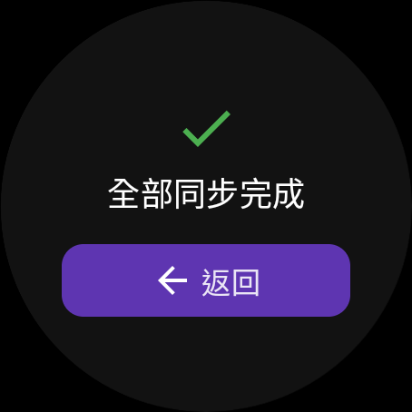

# WearNote Screenshots

This page provides screenshots of the WearNote app interface to help you familiarize with its various screens and features.

## Home Screen

The main screen you see when you open WearNote. From here, you can start recording with a single tap.

## Recording Screen

Shows the current recording in progress, with elapsed time and controls for pausing, stopping, or discarding the recording.

## Uploading Screen

This screen appears when your recording is being uploaded to Google Drive.

## Home Screen with Pending Uploads

When you have recordings waiting to be uploaded, the home screen shows a counter.

## Pending Uploads Screen

View and manage all your recordings that are waiting to be uploaded.

## Upload Completed Screen

After successfully retrying an upload from the pending list.

## App Icon

The WearNote app icon as it appears on your Wear OS device.

## Development View

A technical view of the application architecture (for developers).

